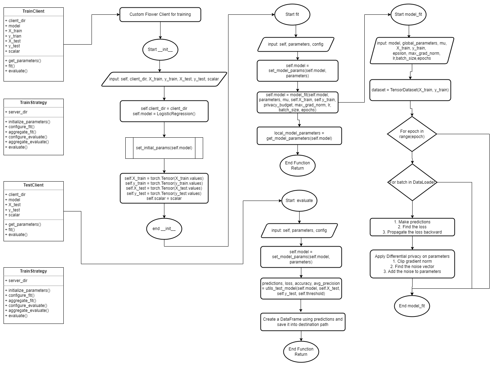

# Table of contents
* [Introduction](#introduction)
* [Data Prep](#data_prep)
* [TrainClient or TestClient instantiation](#client_inst)
* [TrainClient.fit & TestClient.fit](#trainclient_evaluate)
* [TrainStrategy.aggregate_fit](#teststrategy_aggregate)
* [TestStrategy.initialize_parameters](#teststrategy_aggregate)
* [Flow Diagram](#flow)


# Pandemic Federated learning

## Introduction <a name="introduction"></a>
We prepared the features for subjects based on their interaction with other subjects based on specific client data and also instantiated `NumpyClient` based on prepared data. Inside every `NumpyClient` we have instantiated a local neural network based logistic regression which can receive the global parameter and update it based on local available data, post that it can send the output parameter to server. Servers receives the parameters from multiple client and find update the global parameters based on strategy given in `TrainStrategy`. 

In `aggregate_fit` of `TrainStrategy` we store the final trained global output at `server_dir` (`TestStrategy` will also have access to this location)

Similar to Train, while running for test, `NumpyClient` is being generated with all client with their local data and local model. Local model receives the global parameters from `TestStrategy`. *evaluate* function of `NumpyClient` is being used to finally predict on local data and to write the output on local destination path.


## Data Prepration <a name="data_prep"></a>
`train_client_factory` calls `generate_modelling_data` of module `feature_generation_pipeline_withoutduckdb` for all the clients. 
```python
final_data_train = generate_modelling_data(dict_of_loc, end_day = 49,fixed_ending = 49,window_lenght = 2,is_training = True)
```

- **generate_modelling_data**:
    - Based on clients location dictionary, it reads the required data and create a dataframe which consists of all the fetaures for all the pids
    - It also make sure that length of dataset is same as length of dataset in person dataset

## TrainClient or TestClient instantiation<a name="client_inst"></a>
`train_client_factory` and `test_client_factory` instantiate the `TrainClient` and `TestClient` respectively

```python
train_client = TrainClient(client_dir,X_train, y_train, X_test, y_test, scalar = scaler)
test_client = TestClient(client_dir, preds_format_path, preds_dest_path, final_data_test, X_std, y, true_label)
```

Post generating the data, we splits it base on train test splitting strategy and that splitted data is being send to `TrainClient` or `TestClient`. We also make sure that all the required parameters which has to be acessed by other methods has been set as an attribute.

We have instantiated a local model logistic regression model and set the initial parameters as zero
```python
    # Create Model
    self.model = LogisticRegression(param_count=X_test.shape[1])
    print("Model initiated", self.model)
    
    # Setting initial parameters, akin to model.compile for keras models
    set_initial_params(self.model)
```

## TrainClient.fit & TestClient.fit<a name="trainclient_fit"></a>
This is the main function which is being called by flower `ClientManager` for fitting the model on local data. It receives global parameters from server. Firstly it sets local parameter as global parameter then it calls `model_fit` of `utils` module to update the parameter based on local available data.
```python
    self.model = set_model_params(self.model, global_parameters)
    
    # Ignore convergence failure due to low local epochs
    with warnings.catch_warnings():
        warnings.simplefilter("ignore") 
        self.model = model_fit(self.model, global_parameters, mu, self.X_train, self.y_train, 
    privacy_budget, max_grad_norm, lr,batch_size,epochs)
```
It finally returns the updated parameters based to server.

`TestClient.fit` fit doesn't calls the `model_fit`, it simply returns the global parameters.
```python
    def fit(self, parameters, config):  # type: ignore
        
        #return get_model_parameters(self.model), len(self.X_test), {}
        return parameters, len(self.X_test), {}
```

## TrainClient.evaluate and TestClient.evaluate<a name="trainclient_evaluate"></a>

`TrainClient.evaluate` evaluates the loss on hold out data and send it back to server, and server finds the aggregate loss based on multiple clients.
```python
    def evaluate(self, parameters, config):  # type: ignore
        print(f"{self.client_dir} Evaluate called")
        #print("Train Client Evaluate Fn called")
        decoded_parameters = parameters
#         decoded_parameters = homomorphic_encryption.decrypt_weights_param(self.sk, parameters, num_clients)
        self.model = set_model_params(self.model, decoded_parameters)        
        predictions, loss, accuracy, avg_precision = utils_test_model(self.model, self.X_test, self.y_test,threshold)
        print(f"Loss - {loss}, Accuracy - {accuracy}, Average Precision - {avg_precision}")
       
        return (float(loss), len(self.X_test), {"average_precision": avg_precision})
```
`TestClient.evaluate` evaluates as well ass writes the output to destination path.

```python
def evaluate(self, parameters, config):  # type: ignore
    print("Test Client Evaluate Fn called")
    
    self.model = set_model_params(self.model, parameters)
    predictions, loss, accuracy, avg_precision = utils_test_model(self.model, self.X_test, self.y_test, self.threshold)
    print(f"Loss - {loss}, Accuracy - {accuracy}, Average Precision - {avg_precision}")
    
    self.final_op["score"] = predictions
    self.final_op.drop(columns=["covid"], axis = 1, inplace = True)
    if developer_testing:
        merged = self.final_op.merge(self.true_label, on='pid', how='left')
        print("AUPRC::: ", average_precision_score(merged['true_label'].values, predictions))
    print("OP Head:", self.final_op.head(3))
    self.final_op.to_csv(self.preds_dest_path, index = False)
    
    return float(loss), len(self.X_test), {"accuracy": avg_precision}
```

## TrainStrategy.aggregate_fit<a name="trainstrategy_aggregate"></a>
It finally stores updated global parameters on server directory. Which later can be used by `TestStrategy`

```python
def aggregate_fit(self,server_round,results,failures):
    print(f"{self.server_dir} Aggreate fit called")
    agg_params, agg_metrics = self.strategy.aggregate_fit(server_round, results, failures)
    
    #storing aggregated params in server directory
    #Writing model parameters
    params_server_dir_path = pathlib.Path(self.server_dir, "model_param.pkl")
    metrics_server_dir_path = pathlib.Path(self.server_dir, "model_metrics.pkl")
    with open(params_server_dir_path, 'wb') as f:
        pickle.dump(agg_params, f)
        
    with open(metrics_server_dir_path, 'wb') as f:
        pickle.dump(agg_metrics, f)
    return agg_params, agg_metrics 
```

## TestStrategy.initialize_parameters<a name="teststrategy_aggregate"></a>
It reads the saved model parameter from server directory and set the initial parameters as global parameters

```python
def initialize_parameters(self, client_manager):
    local_model_path = pathlib.Path(self.server_dir, "model_param.pkl")
    with open(local_model_path, 'rb') as f:
        parameters = pickle.load(f)
        print("Model Param Read")
        
    initial_parameters = parameters
    self.strategy.initial_parameters = initial_parameters
    
    return initial_parameters

```

## Flow Diagram <a name="flow"></a>


The flow diagram demonstrates how different functions are interacting with each other which is helping us define and implement our federated solution
